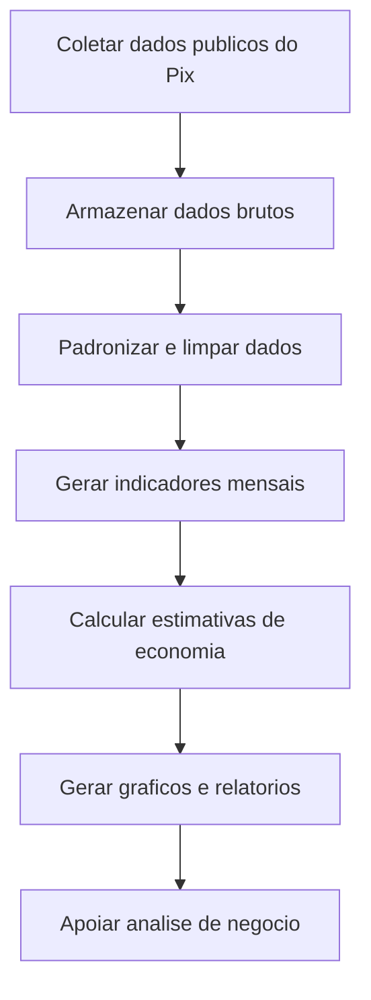
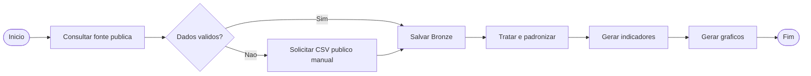

# PRD Funcional: Pix Pipeline Paulo HP

## Visao Geral

O projeto e um pipeline educacional de Engenharia de Dados para analise de dados publicos reais do Pix. Ele organiza a jornada do dado desde a fonte publica ate indicadores e graficos finais para apresentacao.

## Objetivo Funcional

Fornecer uma base analitica simples e reprodutivel para responder perguntas sobre evolucao de transacoes Pix, volume financeiro, ticket medio, crescimento mensal e economia potencial estimada em cenarios hipoteticos.

## Contexto de Negocio

O pipeline simula uma solucao que poderia apoiar areas de meios de pagamento, canais digitais, inteligencia comercial, planejamento estrategico e BI em uma instituicao financeira. A solucao utiliza apenas dados publicos e nao depende de informacoes internas.

## Publico-Alvo

- Estudantes iniciantes em Engenharia de Dados.
- Analistas de dados em formacao.
- Profissionais que desejam demonstrar conhecimento basico em PySpark, Data Lake e pipelines analiticos.
- Avaliadores tecnicos de projeto academico ou portfolio.

## Problema a Ser Resolvido

Dados publicos geralmente estao em formato operacional e precisam ser coletados, tratados e agregados antes de gerar analises de negocio. O projeto resolve esse problema criando um fluxo organizado por camadas.

## Escopo Funcional

- Coletar dados publicos reais do Pix.
- Salvar dados brutos na camada Bronze.
- Padronizar dados na camada Silver.
- Criar indicadores mensais na camada Gold.
- Calcular cenarios hipoteticos de economia potencial.
- Gerar graficos finais para apresentacao.
- Permitir execucao completa pelo terminal.

## Fora de Escopo

- Uso de dados internos de instituicoes financeiras.
- Conclusoes sobre economia real comprovada.
- Dashboard interativo em producao.
- Orquestracao corporativa com Airflow.
- Infraestrutura em nuvem.

## Fontes de Dados

A fonte principal e a API OData de dados abertos do Banco Central do Brasil para estatisticas de transacoes Pix:

```text
https://olinda.bcb.gov.br/olinda/servico/Pix_DadosAbertos/versao/v1/odata/EstatisticasTransacoesPix(Database=@Database)?@Database='202401'&$top=50000&$format=json
```

Como contingencia, o projeto aceita CSV publico manual em `data/input`, desde que contenha as colunas `AnoMes`, `VALOR` e `QUANTIDADE`.

## Perguntas de Negocio

1. Como evoluiu a quantidade de transacoes Pix ao longo do tempo?
2. Como evoluiu o volume financeiro movimentado via Pix?
3. Qual foi o ticket medio mensal?
4. Houve crescimento mensal relevante em quantidade ou valor?
5. Qual seria a economia potencial em cenarios hipoteticos de substituicao de cartao?
6. Qual seria a economia potencial em cenarios hipoteticos de substituicao de transferencias tradicionais?

## Indicadores Funcionais

- Quantidade mensal de transacoes Pix.
- Valor financeiro mensal movimentado.
- Ticket medio mensal.
- Crescimento percentual mensal da quantidade.
- Crescimento percentual mensal do valor.
- Economia potencial estimada com MDR de cartao.
- Economia potencial estimada com tarifas de transferencia.

## Regras de Negocio

- A execucao padrao deve usar dados publicos reais.
- O fallback manual deve usar arquivo publico real, nao dados ficticios.
- Valores negativos indevidos devem ser filtrados.
- Divisoes por zero devem resultar em nulo, nao em erro silencioso.
- Estimativas de economia devem ser identificadas como hipoteticas.

## Premissas

- MDR debito: 1,08%.
- MDR credito: 2,26%.
- Tarifas de transferencia: R$ 5,00, R$ 10,00 e R$ 15,00.
- Percentuais de substituicao sao cenarios didaticos.

## Limitacoes

A analise de economia potencial e baseada em cenarios hipoteticos. Os dados publicos nao identificam qual meio de pagamento cada transacao Pix substituiu. Por isso, os valores calculados nao representam economia real comprovada, mas sim uma simulacao analitica para fins educacionais.

## Jornada Funcional do Dado



## BPMN Simplificado



## Criterios de Aceite Funcionais

1. O pipeline deve consumir dados publicos reais.
2. As camadas Bronze, Silver e Gold devem ser geradas.
3. Os indicadores mensais devem ser calculados.
4. As estimativas devem ser apresentadas como hipoteticas.
5. Os graficos finais devem ser gerados.
6. A execucao deve funcionar pelo terminal no WSL.

## Riscos Funcionais

- Indisponibilidade temporaria da API publica.
- Mudanca de schema na fonte do Banco Central.
- Interpretacao incorreta das estimativas como economia real.

## Melhorias Futuras

1. Adicionar comparacao com series publicas de cartao.
2. Criar painel interativo.
3. Expandir analises por recorte geografico, quando disponivel.
4. Automatizar execucao diaria ou mensal.
5. Adicionar testes funcionais automatizados.


## Atualização Analytics e Agentes

Esta versão inclui EDA, feature engineering, feature selection, regressão, classificação, métricas consolidadas, Test Few, Test All, Run All Notebook, testes unitários, guardrails, matriz de aderência, Brain documental inicial e validação de agents/skills. MCP não foi implementado nesta versão e permanece como evolução futura documentada.

## Ajuste Final: Agents, Skills E MCP CSV

O escopo funcional final inclui pipeline completo do Pix, analytics, visualizacoes, modelos educacionais, agents/skills e MCP CSV. O MCP CSV permite consulta read-only dos CSVs analiticos em `reports/`, com foco em demonstracao, validacao e explicacao de metricas.

Escopo implementado:

- Pipeline Pix com Bronze, Silver e Gold.
- EDA, feature engineering, feature selection, regressao, classificacao e metricas.
- Agents/skills majoritariamente agnosticos.
- Skill especifica do Pix.
- MCP CSV demonstravel por CLI.
- Brain documental em Markdown em `docs/knowledge_base/`.

Fora do escopo desta versao:

- MCP Spark.
- MCP PowerBI.
- MCP DeltaLake.
- MCP Brain.

Esses itens ficam registrados como evolucao futura.
