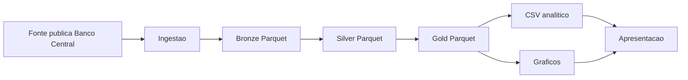
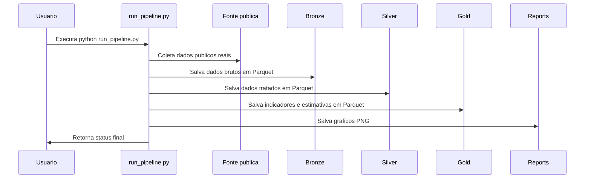

# PRD Tecnico: Pix Pipeline Paulo HP

## Visao Tecnica

O projeto implementa um pipeline local em Python e PySpark, executavel em WSL Linux, para coleta de dados publicos do Pix, armazenamento em Parquet, transformacoes analiticas e geracao de graficos.

## Arquitetura da Solucao



## Stack Tecnologica

- Python 3.
- PySpark para leitura, transformacao, agregacao e escrita em Parquet.
- pandas para ingestao da resposta JSON e conversao de datasets agregados para visualizacao.
- requests para chamada HTTP da fonte publica.
- matplotlib para graficos.
- Jupyter Notebook para etapas didaticas.

## Estrutura de Diretorios

```text
pix_pipeline_paulo_hp/
├── docs/
├── src/
├── scripts/
├── notebooks/
├── data/
├── reports/
├── run_pipeline.py
├── README.md
├── requirements.txt
└── .gitignore
```

## Fluxo Tecnico do Pipeline



## Camadas Bronze, Silver e Gold

A camada Bronze fica em `data/bronze/pix_raw` e preserva os dados brutos obtidos da fonte publica.

A camada Silver fica em `data/silver/pix_clean` e contem colunas padronizadas, tipos corrigidos e registros invalidos filtrados.

A camada Gold fica em `data/gold` e contem tabelas analiticas prontas para consumo por BI, relatorios ou visualizacao.

## Estrategia de Ingestao

O modulo `src/data_source.py` executa a chamada HTTP para a API OData do Banco Central. A resposta JSON e convertida para pandas e depois para Spark DataFrame no notebook de ingestao.

A validacao minima exige registros e as colunas `AnoMes`, `VALOR` e `QUANTIDADE`. Se a API estiver indisponivel, o codigo procura CSV publico manual em `data/input`.

## Estrategia de Transformacao

O notebook Silver normaliza nomes de colunas, remove acentos, converte valores monetarios e quantidades, extrai ano e mes a partir de `ano_mes` e filtra valores negativos indevidos.

## Estrategia de Agregacao

O notebook Gold agrupa por `ano_mes` e calcula total de transacoes, valor total, ticket medio e crescimento percentual mensal usando Window Functions do Spark.

## Estrategia de Visualizacao

O notebook de visualizacao le tabelas Gold agregadas, converte para pandas e gera cinco graficos formais com titulo, eixo X, eixo Y, legenda quando aplicavel e grid.

## Tratamento de Erros

- Fonte vazia gera erro explicito.
- Ausencia de colunas obrigatorias gera erro explicito.
- Ausencia de CSV manual no fallback gera orientacao clara.
- Outputs obrigatorios ausentes interrompem a execucao.
- Divisoes por zero retornam nulo nos indicadores.

## Tratamento de SPARK_HOME

O modulo `src/spark_session.py` contem `sanitize_spark_home`. Se `SPARK_HOME` estiver vazio ou apontar para um diretorio sem `bin/spark-submit`, a variavel e removida do ambiente da execucao. Isso permite que o PySpark instalado no ambiente virtual seja usado corretamente.

## Configuracao de Ambiente WSL

A execucao esperada ocorre no terminal do VSCode com ambiente virtual ativo:

```bash
source .venv/bin/activate
pip install -r requirements.txt
python run_pipeline.py
```

## Dependencias

As dependencias estao em `requirements.txt` e incluem PySpark, pandas, numpy, matplotlib, requests, Jupyter, notebook, ipykernel e pyarrow.

## Execucao via run_pipeline.py

`run_pipeline.py` chama `scripts.rebuild_pipeline.main`, que limpa outputs, executa notebooks por `jupyter nbconvert`, salva notebooks executados em `.pipeline_runs` e valida outputs finais.

## Scripts Auxiliares

- `scripts/clean_outputs.py`: remove dados gerados, figuras e caches.
- `scripts/rebuild_pipeline.py`: executa o pipeline completo.
- `scripts/validate_pipeline.py`: valida estrutura e outputs.
- `scripts/presentation_demo.py`: mostra resumo tecnico dos outputs gerados.

## Padroes de Nomenclatura

- Caminhos centralizados em `src/config.py`.
- Diretórios de dados por camada: Bronze, Silver e Gold.
- Notebooks com prefixos numericos para ordenacao sequencial.
- Colunas analiticas em snake_case.

## Criterios Tecnicos de Aceite

1. `python -m compileall src scripts` executa sem erro.
2. `python run_pipeline.py` executa sem erro.
3. `python scripts/validate_pipeline.py` executa sem erro.
4. Bronze, Silver e Gold possuem registros.
5. Os cinco graficos finais existem.
6. O projeto nao contem caminhos absolutos do Windows nos arquivos principais.
7. O projeto nao usa dados ficticios na execucao padrao.
8. O projeto nao contem emojis nos arquivos Markdown e notebooks.

## Limitacoes Tecnicas

- A execucao depende de rede para ingestao automatica.
- O schema da API publica pode mudar.
- O volume coletado e limitado por parametro `$top` da consulta OData.
- A execucao local depende de memoria e Java disponivel para PySpark.

## Melhorias Futuras

1. Parametrizar o periodo de consulta da API.
2. Implementar testes automatizados com pytest.
3. Usar Delta Lake para versionamento das camadas.
4. Criar dashboard interativo.
5. Adicionar Dockerfile para ambiente reproduzivel.
6. Integrar orquestrador como Apache Airflow.


## Atualização Analytics e Agentes

Esta versão inclui EDA, feature engineering, feature selection, regressão, classificação, métricas consolidadas, Test Few, Test All, Run All Notebook, testes unitários, guardrails, matriz de aderência, Brain documental inicial e validação de agents/skills. MCP não foi implementado nesta versão e permanece como evolução futura documentada.

## Arquitetura Final Com MCP CSV

A arquitetura tecnica final preserva o pipeline PySpark local e adiciona apenas o MCP CSV como camada read-only de consulta aos CSVs de `reports/`.

Componentes:

- `src/`: configuracoes, SparkSession, fonte de dados, qualidade e funcoes auxiliares.
- `notebooks/`: execucao sequencial do pipeline e analytics.
- `scripts/`: limpeza, execucao, validacao, Test Few e sincronizacao de skills.
- `agents_skills/`: skills agnosticas e skill especifica Pix.
- `mcp/`: MCP CSV com CLI demonstravel.
- `docs/knowledge_base/`: Brain documental em Markdown.

O MCP CSV usa `pathlib.Path`, restringe leitura a `reports/`, bloqueia caminhos absolutos e `..`, permite apenas `.csv` e nao altera arquivos.
