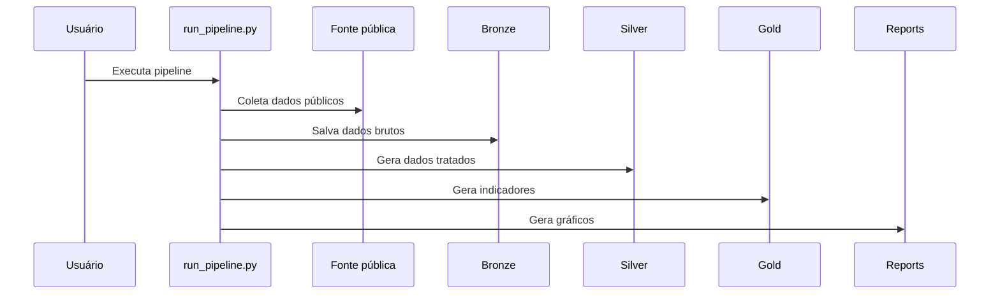

# Templates de PRD

## PRD Funcional

Estrutura mínima:

1. Visão geral.
2. Objetivo funcional.
3. Contexto de negócio.
4. Público-alvo.
5. Problema.
6. Escopo.
7. Fora de escopo.
8. Fontes de dados.
9. Perguntas de negócio.
10. Indicadores.
11. Regras de negócio.
12. Premissas.
13. Limitações.
14. Jornada do dado em linguagem de negócio.
15. Critérios de aceite.
16. Riscos.
17. Melhorias futuras.

## PRD Técnico

Estrutura mínima:

1. Visão técnica.
2. Arquitetura da solução.
3. Stack tecnológica.
4. Estrutura de diretórios.
5. Fluxo técnico do pipeline.
6. Camadas Bronze, Silver e Gold.
7. Estratégia de ingestão.
8. Estratégia de transformação.
9. Estratégia de agregação.
10. Estratégia de visualização.
11. Tratamento de erros.
12. Tratamento de `SPARK_HOME`.
13. Configuração WSL.
14. Dependências.
15. Execução via `run_pipeline.py`.
16. Scripts auxiliares.
17. Critérios técnicos de aceite.
18. Limitações técnicas.
19. Melhorias futuras.

## Diagramas Mermaid

Arquitetura técnica:

Sequência técnica:

